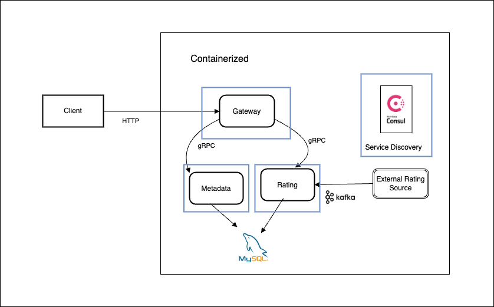

# Movie Microservice

Movie Microservice is a scalable and containerized system designed to manage movie metadata and ratings. It utilizes a microservices architecture, supporting both gRPC and HTTP communication. The service is deployed locally using Kubernetes with Minikube and leverages Apache Kafka for asynchronous communication to fetch ratings.

## Features

- **Microservices Architecture** - Modular services for better scalability and maintainability
- **PostgreSQL** - Persistent database storage for movies and ratings
- **Apache Kafka** - Asynchronous messaging for rating updates
- **gRPC & HTTP Support** - Efficient communication between services
- **Consul Service Discovery** - Dynamic service discovery and health checks
- **Dockerized Deployment** - Containerized services for ease of deployment
- **Kubernetes & Minikube** - Local orchestration and scaling

## Architecture



## Tech Stack

- **Go** - Core backend logic
- **PostgreSQL** - Database for storing movie and rating data
- **Apache Kafka** - Message broker for asynchronous communication
- **gRPC & HTTP** - Dual communication protocols
- **Consul** - Service discovery and health checks
- **Docker** - Containerized services
- **Kubernetes & Minikube** - Local deployment and orchestration

## Getting Started

### Prerequisites

- [Go](https://go.dev/)
- [Docker](https://www.docker.com/)
- [Minikube](https://minikube.sigs.k8s.io/docs/)
- [kubectl](https://kubernetes.io/docs/tasks/tools/)
- [Apache Kafka](https://kafka.apache.org/)
- [PostgreSQL](https://www.postgresql.org/)

### Installation

1. Clone the repository:
   ```sh
   git clone https://github.com/bikraj2/movie_microservice.git
   cd movie_microservice
   ```

2. Start Minikube:
   ```sh
   minikube start
   ```

3. Apply Kubernetes configurations:
   ```sh
   kubectl apply -f kubernetes-deployment.yml
   ```

4. Verify that all services are running:
   ```sh
   kubectl get pods
   ```

## Roadmap

- [ ] Implement authentication for API access
- [ ] Add caching with Redis for optimized queries
- [ ] Deploy to a cloud Kubernetes cluster
- [ ] Integrate monitoring and logging

## Contributing

Contributions are welcome! Feel free to open issues or submit pull requests.

## License

This project is licensed under the MIT License.

